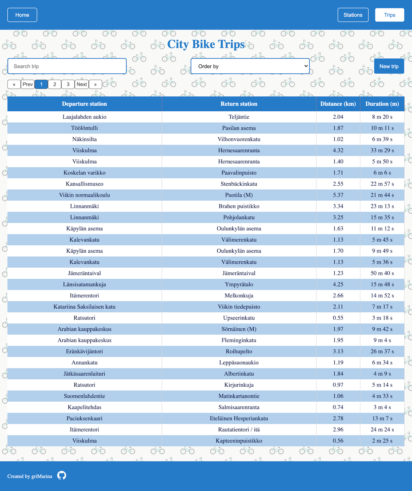

# Helsinki City Bike App

This project was created as a pre-assignment for the [Solita Dev Academy](https://github.com/solita/dev-academy-2022-fall-exercise).

This web application displays information about bicycle stations and journeys made with city bikes in the Helsinki Capital area. The frontend was created with Vue.js and the backend with PHP and MySQL. The application includes automated tests for both the frontend (with Cypress) and the backend (with PHPUnit).

#

    <a href="#prerequisites">Prerequisites</a>
    ·
    <a href="#running-the-backend">Backend</a>
    ·
    <a href="#running-the-frontend">Frontend</a>
    ·
    <a href="#data-import">Data import</a>
    ·
    <a href="#testing">Testing</a>
    ·
    <a href="#features">Features</a>
    ·
    <a href="#screenshots">Screenshots</a>
  

## Getting Started

### Prerequisites

- Node.js 16.15.0
- Docker 23.0.5

### Installation

### Running the backend

1. Clone the repository: `git clone https://github.com/griMarina/city-bike.git`
2. Navigate to the project directory: `cd city-bike`
3. Build and start the backend using docker-compose: `docker compose up -d`
4. The server runs at `http://localhost:8080`

### Running the frontend

1. Navigate to the frontend directory: `cd city-bike/frontend`
2. Install the required packages: `npm install`
3. Run the development server: `npm run dev`
4. Access the application in your web browser at `http://127.0.0.1:3000`

### Data import

1. Make sure that the backend is running in a docker container
2. Open the CLI in the docker container: `docker exec -it city-bike-backend-1 /bin/bash`
3. To import data with stations, run: `php cli.php stations:import stations.csv`
4. To import data with trips from the first file (`trips-1.csv`), run: `php cli.php trips:import trips-1.csv`
5. To import data with trips from the second file (`trips-2.csv`), run: `php cli.php trips:import trips-2.csv`
6. To import data with trips from the third file (`trips-3.csv`), run: `php cli.php trips:import trips-3.csv`

Please be patient as the data import process may take some time. Importing trip data takes about 5-7 minutes for each file. However, you can continue to use the app during the import process!

### Testing

#### Frontend (Cypress)

1. Make sure that the app is running at `http://127.0.0.1:3000`
2. Navigate to the frontend directory: `cd city-bike/frontend`
3. Run `npm run test` to run the Cypress tests

#### Backend (PHPUnit)

1. Make sure that the backend is running in docker container
2. Open the cli in the docker container: `docker exec -it city-bike-backend-1 /bin/bash`
3. Run `composer test` to run the PHPUnit tests

## Technologies Used

- Vue.js 3
- Leaflet (for the map)
- Axios (for API calls)
- PHP 8.0
- MySQL
- Composer (for PHP package management)
- Symfony Console (for building cli app in PHP)
- Cypress (for e2e testing)
- PHPUnit (for backend testing)

## Features

- Data import from the CSV files to the MySQL database
- Data validation before importing
- Station list display (pagination, ordering by column, searching)
- Journey list display (pagination, ordering by column, searching)
- Single station display:
  - Total number of journeys starting from the station
  - Total number of journeys ending at the station
  - Station location on the map
  - The average distance of a journey starting from the station
  - The average distance of a journey ending at the station

## Screenshots

### Station List View

### Trip List View

### Single Station View

## Acknowledgments

The data about bicycle stations and journeys is owned by City Bike Finland and HSL. [https://www.avoindata.fi/data/en/dataset/hsl-n-kaupunkipyoraasemat/resource/a23eef3a-cc40-4608-8aa2-c730d17e8902](https://www.avoindata.fi/data/en/dataset/hsl-n-kaupunkipyoraasemat/resource/a23eef3a-cc40-4608-8aa2-c730d17e8902)
